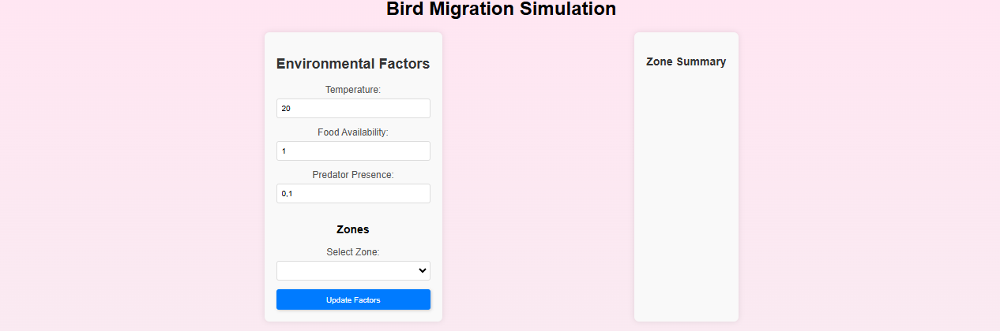
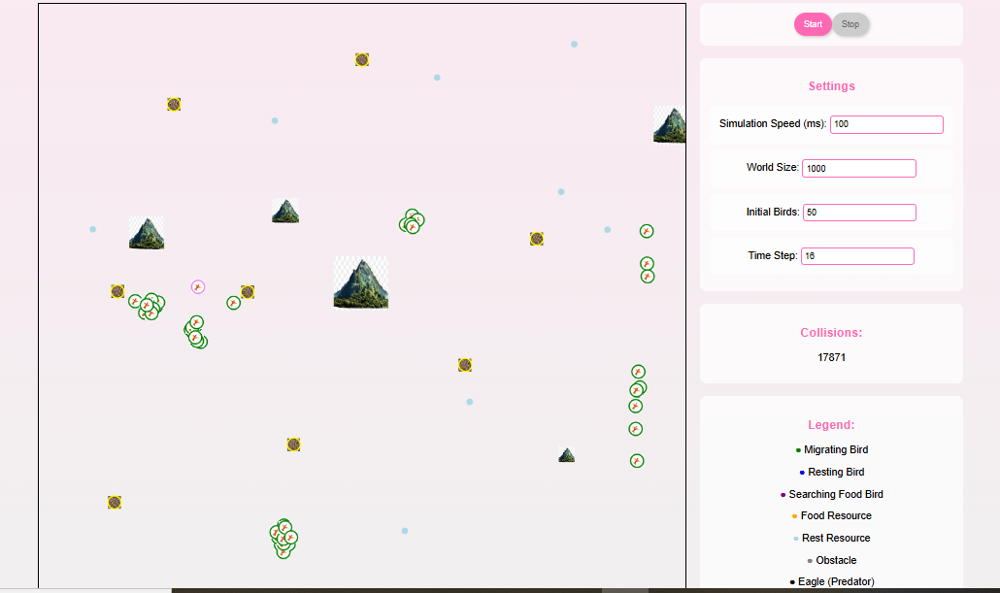

# Bird Migration Simulation

Ce projet est une simulation multi-agent de la migration d'oiseaux, développée avec Go (backend) et React (frontend). Il permet de visualiser le déplacement d'oiseaux dans un environnement simulé, d'ajuster les paramètres de la simulation, et de sauvegarder l'état de celle-ci.

## Fonctionnalités Principales

*   **Simulation de Migration :** Les oiseaux (agents) se déplacent dans un environnement simulé avec des règles simples (migration, repos, recherche de nourriture, évitement d'obstacles).
*   **Visualisation en Temps Réel :** Le frontend React affiche l'état de la simulation en temps réel.
*   **Contrôles :** Boutons pour démarrer et arrêter la simulation.
*   **Paramètres Ajustables :** Possibilité de modifier la vitesse de la simulation et la taille du monde.
*   **Persistance des Données :** Sauvegarde et chargement de l'état de la simulation via SQLite.
*   **Indicateur de Collisions :** Affiche le nombre de collisions entre oiseaux.
*   **Interface Utilisateur Dynamique :** L'interface a un thème inspiré de Barbie, avec des couleurs vives et des animations subtiles.
*   **Facteurs Environnementaux :** Ajustez la température, la disponibilité de la nourriture et la présence de prédateurs pour influencer le comportement des oiseaux.

## Architecture Technique

*   **Backend (Go/Gin) :**
    *   Utilise le framework `Gin` pour créer une API REST.
    *   Implémente la logique de la simulation, la gestion des agents, et les interactions avec l'environnement.
    *   Stocke et récupère l'état de la simulation avec `SQLite`.
    *   Utilise des channels (au lieu de mutexes) pour la communication entre les goroutines.
*   **Frontend (React) :**
    *   Utilise `React` pour la construction des composants et la gestion de l'état.
    *   Utilise `axios` pour communiquer avec l'API REST du backend.
    *   Affiche le monde de la simulation avec un élément `canvas`.
    *   Utilise `useEffect` pour faire les appels à l'API de manière efficace.

## Principe de la Simulation

La simulation repose sur un modèle multi-agent où chaque oiseau est représenté comme un agent autonome avec des comportements spécifiques. Les agents interagissent avec leur environnement et entre eux selon des règles prédéfinies.

### Communication entre les Agents

Les agents communiquent indirectement en observant leur environnement immédiat. Chaque agent peut percevoir la position des autres agents, les obstacles, et les ressources disponibles dans son voisinage. Cette perception influence leurs décisions et actions, telles que :

* **Migration :** Les agents se déplacent vers une destination cible en évitant les obstacles et en suivant des trajectoires optimales.
* **Repos :** Les agents peuvent décider de se reposer après une certaine distance parcourue ou en fonction de leur niveau d'énergie.
* **Recherche de Nourriture :** Les agents cherchent des ressources alimentaires lorsqu'ils ont faim et ajustent leur trajectoire en conséquence.
* **Évitement des Obstacles :** Les agents détectent et contournent les obstacles pour éviter les collisions.
* **Interaction Sociale :** Les agents peuvent ajuster leur comportement en fonction de la proximité d'autres agents, par exemple en formant des groupes pour migrer ensemble.

### Modèle de Simulation

La simulation est divisée en cycles de temps discrets. À chaque cycle, les agents :

1. **Perçoivent leur environnement :** Chaque agent collecte des informations sur son voisinage immédiat.
2. **Décident de leurs actions :** En fonction des informations perçues, chaque agent décide de son action suivante (se déplacer, se reposer, chercher de la nourriture, etc.).
3. **Agissent :** Les agents exécutent leurs actions, ce qui peut modifier leur position, leur état interne, et l'état de l'environnement.

Le backend en Go gère la logique de la simulation, en mettant à jour l'état des agents et de l'environnement à chaque cycle. Le frontend en React affiche l'état actuel de la simulation en temps réel, permettant aux utilisateurs de visualiser les mouvements des oiseaux et d'interagir avec la simulation.

## Installation et Lancement

### Prérequis

*   [Go](https://go.dev/dl/) (version 1.18 ou supérieure)
*   [Node.js](https://nodejs.org/en/download/) (version 16 ou supérieure) et npm (ou yarn)
*   [Git](https://git-scm.com/downloads) (si vous souhaitez cloner le repo)
*   Un éditeur de code (ex: VS Code, GoLand)
*   Une installation de SQLite pour pouvoir utiliser la base de données en backend

### Lancer le Backend

1. **Clonez le dépôt** :
   ```sh
   git clone git@gitlab.utc.fr:cmbouopd/migration.git
   cd migration/backend
   ```

2. **Créez un fichier `.env`** :
   - Créez un fichier `.env` à la racine du répertoire `backend` et ajoutez les variables d'environnement nécessaires :
     ```env
     PORT=8080
     SIMULATION_SPEED=100
     WORLD_SIZE=1000
     INITIAL_BIRDS=50
     ENVIRONMENT_SIZE=100
     OBSTACLE_COUNT=5
     RESOURCE_COUNT=5
     DB_PATH=simulation.db
     TEMPERATURE=20.0
     FOOD_AVAILABILITY=1.0
     PREDATOR_PRESENCE=0.0
     ```

3. **Lancez l'exécutable** :
   - Si vous avez déjà l'exécutable, lancez-le directement :
     ```sh
     ./bird-migration-simulation
     ```

4. **Accédez à l'API** :
   - L'API sera accessible à l'adresse `http://localhost:8080`.

### Lancer le Frontend

1. **Naviguez vers le répertoire du frontend** :
   ```sh
   cd ../frontend
   ```

2. **Installez les dépendances** :
   ```sh
   npm install
   ```

3. **Lancez le frontend** :
   ```sh
   npm start
   ```

4. **Accédez à l'application** :
   - L'application sera accessible à l'adresse `http://localhost:3000`.

### Utilisation

*   **Démarrer la Simulation :** Cliquez sur le bouton "Start" pour lancer la simulation.
*   **Arrêter la Simulation :** Cliquez sur le bouton "Stop" pour arrêter la simulation.
*   **Modifier les paramètres :** Utilisez le formulaire "Settings" pour modifier la vitesse de la simulation et la taille du monde.
*   **Modifier les facteurs environnementaux :** Utilisez le tableau de bord pour ajuster la température, la disponibilité de la nourriture et la présence de prédateurs.
*   **Visualiser la Simulation :** Observez le mouvement des oiseaux dans la zone de simulation.
*   **Charger une Sauvegarde :** Cliquez sur le bouton "Load" pour récupérer la dernière sauvegarde depuis la base de données.
*   **Enregistrer la Sauvegarde :** Cliquez sur le bouton "Save" pour enregistrer l'état actuel de la simulation dans la base de données.

## Visualisation

Voici quelques captures d'écran de l'application :

### Tableau de Bord



### Simulation



## Structure du Code

```
bird-migration-simulation/
├── backend/           # Backend Go avec Gin
│   ├── main.go        # Fichier principal du backend
│   ├── go.mod         # Dépendances Go
│   ├── go.sum
│   └── config.go      # Configuration du backend
├── frontend/          # Frontend React
│   ├── src/           
│   │   ├── App.js       # Composant principal de l'application
│   │   ├── components/  # Composants React
│   │   │   ├── SimulationCanvas.js # Canvas pour la simulation
│   │   │   ├── Controls.js      # Contrôles de la simulation
│   │   │   ├── Settings.js      # Panneau de paramètres
│   │   │   ├── Dashboard.js     # Tableau de bord pour les facteurs environnementaux
│   │   ├── utils/      # Fonctions utilitaires
│   │   │   ├── api.js  # Fonctions pour l'API backend
│   │   ├── styles/     # Styles
│   │   │   ├── styles.css # Styles globaux
│   │   └── index.js      # Point d'entrée du frontend
│   ├── package.json   # Dépendances Node
│   ├── package-lock.json
│   └── .env           # Variables d'environnement
└── README.md        # Informations du projet
```

## Contributions

Les contributions sont les bienvenues ! Voici quelques idées d'amélioration :

*   Ajouter des comportements plus complexes pour les oiseaux (vol en groupe, évitement des obstacles, recherche de nourriture).
*   Améliorer la visualisation avec un environnement plus détaillé.
*   Ajouter des interfaces pour l'ajout d'obstacles et de ressources par l'utilisateur.
*   Ajouter des tests unitaires et d'intégration.
*   Mettre en place une sauvegarde et un chargement de l'état plus sophistiqués (gestion de différentes sauvegardes, etc).
*   Améliorer l'UI pour une expérience utilisateur plus agréable.

Pour contribuer, suivez les étapes suivantes :

1.  **Fork** le dépôt.
2.  **Clonez** votre fork.
3.  **Créez une branche** pour vos modifications.
4.  **Appliquez vos modifications**.
5.  **Poussez** votre branche sur votre fork.
6.  **Ouvrez une Pull Request** vers le dépôt original.

## Auteur

Jefferson MBOUOPDA 

## Membre du groupe

* Jefferson MBOUOPDA : a fait toute la partie frontEnd, l'APi backend, la config, la BD et le main, la rédaction du readme, la note de clarification et uml-diagram.
* Chloe TCHIENANG    : a fait la partie sur la boucle de simulation.
* Estelle TOURASSE   : a contribué sur les fonctions utilitaires.
* Ruben MOUGOUE      : a fais la partie sur le comportement des oiseaux.
* Zoé POIRIER        : était malade lorsqu'on a décidé de faire ce deuxième projet.

On a tous conttribué sur la l'UML et la Note de clarification

**MERCI**
# Projet de AI30 A24
